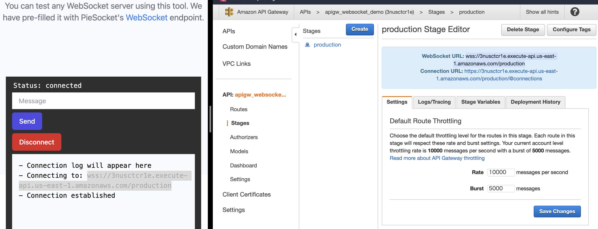
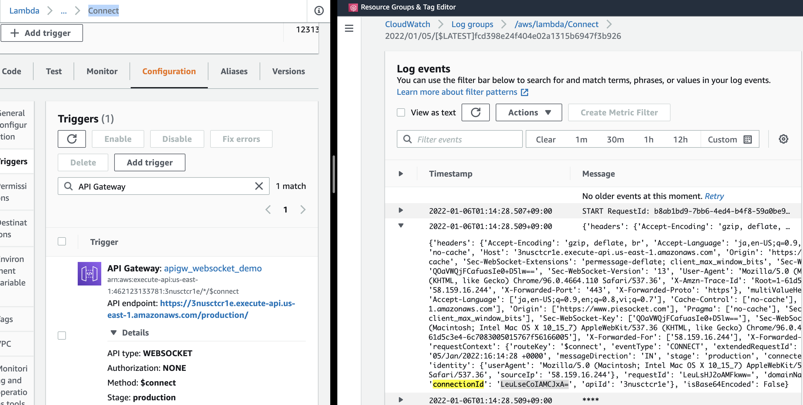
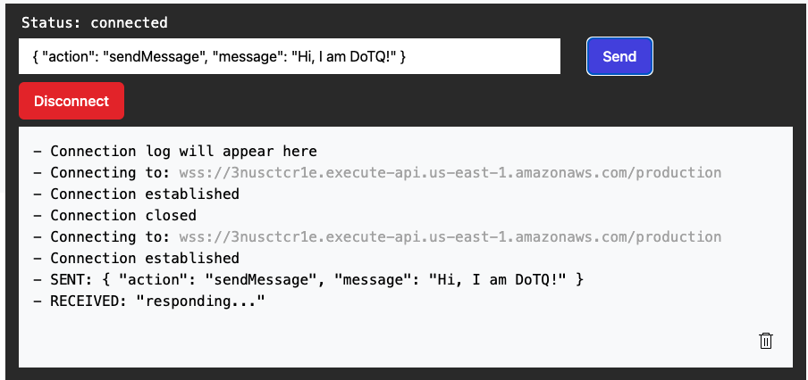
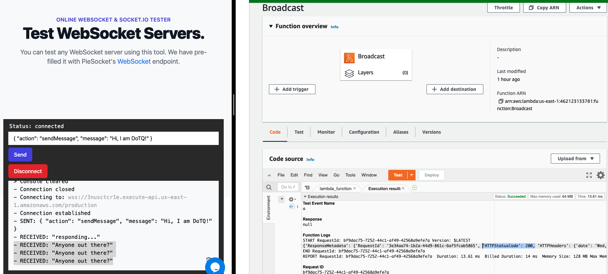

# aws-lambda-apigw-websocket 🐳


[](https://github.com/tquangdo/aws-lambda-apigw-websocket/issues/new)

## reference
[youtube](https://www.youtube.com/watch?v=FIrzkt7kH80)

## A) create 3 lambda functions
### 1/ `Connect`
+ Function name=`Connect`
+ Runtime=`python 3.9`
```shell
# python3 --version
Python 3.9.9
```
+ Execution role=`Create a new role` (because need to check CWatch log groups)
### 2/ create the same with `SendMSG` & `Broadcast`

## B) create api gateway
+ api type=`WebSocket API`
+ api name=`apigw_websocket_demo`
+ Route selection expression=`$request.body.action`
+ click `Add $connect route`
+ click `Add custom route`: Route key=`sendMessage`
+ `Integration for $connect`: Integration type=`Lambda` & Lambda function=`Connect`
+ `Integration for $sendMessage`: Integration type=`Lambda` & Lambda function=`SendMSG`

## C) test connect websocket
### api gateway
+ tab `Stages` > `production` > copy `WebSocket URL`
+ paste to tool ★★:`https://www.piesocket.com/websocket-tester` > click `Connect`

### lambda `Connect` & cloudwatch logs
+ search KW `connectionId` in logs will see `LexU_f4moAMCECw=`


## D) run lambda `SendMSG`
+ tab `Stages` > `production` > copy `Connection URL`
+ paste into `sendmsg.py`:
```py
endpoint_url="xxxxxxxxxx.com/production"
```
+ lambda's SG > attach policies=`AmazonAPIGatewayInvokeFullAccess`
+ tool ★★: type this MSG:
```json
{ "action": "sendMessage", "message": "Hi, I am DoTQ!" }
```
+ will see `RECEIVED: "responding..."` as `sendmsg.py > responseMessage = "responding..."`


## E) run lambda `Broadcast`
+ tab `Stages` > `production` > copy `Connection URL`
+ paste into `sendmsg.py`:
```py
endpoint_url="xxxxxxxxxx.com/production"
```
+ lambda's SG > attach policies=`AmazonAPIGatewayInvokeFullAccess`
+ click `Test` -> will see "Anyone out there?" in tool ★★
```json
{
  "connectionId": "LexU_f4moAMCECw=",
  "message": "Anyone out there?"
}
```


